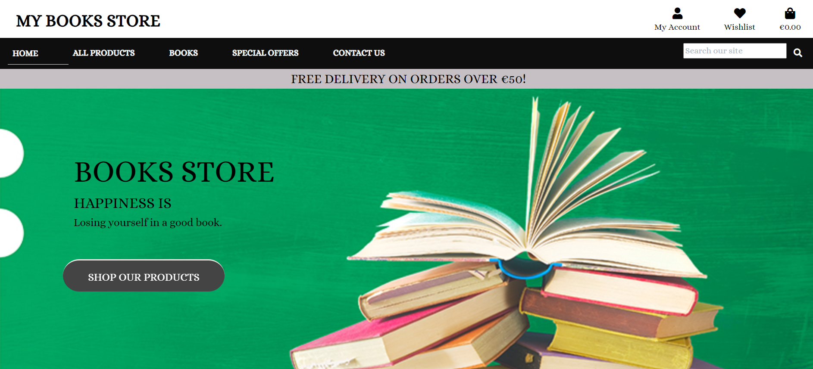

<h1>My Books Store - Online Book shop</h1>

 

<h3>Developer: Dhvani Intwala</h3>

## [TABLE OF CONTENTS](#table-of-contents)<!-- omit in toc -->

- [Overview](#overview)
- [User Experience (UX)](#user-experience-ux)
  - [Project goals](#project-goals)
  - [Project Objectives:](#project-objectives)
- [User Stories](#user-stories)
    - [Strategy](#strategy)
    - [Scope](#scope)
    - [Structure](#structure)
    - [Skeleton](#skeleton)
    - [Surface](#surface)
- [Agile Methodology](#agile-methodology)
- [Features](#features)
    - [Home page](#home-page)
- [Responsive Layout and Design](#responsive-layout-and-design)
- [Testing](#testing)
- [AWS Setup Process](#aws-setup-process)
  - [AWS S3 Bucket](#aws-s3-bucket)
  - [IAM Set Up](#iam-set-up)
  - [Connecting AWS to the Project](#connecting-aws-to-the-project)
- [Stripe Payments](#stripe-payments)
  - [Payments](#payments)
  - [Webhooks](#webhooks)
- [Technologies Used](#technologies-used)
  - [Languages Used](#languages-used)
  - [Django Packages](#django-packages)
  - [Frameworks - Libraries - Programs Used](#frameworks---libraries---programs-used)
- [Creating the Django app](#creating-the-django-app)
- [Deployment of This Project](#deployment-of-this-project)
- [Deployment](#deployment)
  - [Deploy on Heroku](#deploy-on-heroku)
  - [Fork the repository](#fork-the-repository)
  - [Clone the repository](#clone-the-repository)
- [Credits](#credits)
  - [Code](#code)
  - [Media](#media)
  - [Acknowledgements](#acknowledgements)


## Overview

My Books Store is an E-commerce website created for a fictive books shop located in Schelklingen, Germany. The main purpose of the project was to implement a fully functional online store that will make the process of selecting and purchasing books products much easier for customers.
The users are given the possibility to see every product's detail, create a Wishlist, add items to the shopping bag, purchase with online payment method and access order history.
The website was developed using Python (Django), HTML, CSS and JavaScript. The data was stored in a PostgreSQL database using ElephantSql for manipulation.


## User Experience (UX)

### Project goals

- To create an e-commerce application - My Books Store that is used for ordering Books by customers.

### Project Objectives:

- To create a website with a simple and intuitive User Experience;
- To add content that is relevant and helps create a better image of the books shop.
- To differentiate between client and staff member accounts.
- To implement fully functional features that will ease upgrade clients' experience with the books store services.
- To make the website available and functional on every device.

## User Stories

#### Strategy
<hr>

- As a website user, I can:

1. Navigate around the site and easily view the desired content.
2. View a list of products and choose accordingly.
3. Search products to find a specific product.
4. Click on a product to read and view the details.
5. Register for an account.


- As a logged in website user, I can:

1. make wishlist products page in which I can edit or/and buy books at any time
2. Subscribe to a newsletter, so I can always be up to date with the latest promotions
3. Save my data under my personal profile.
4. Manage my profile by updating my details.
6. Logout of the website.
7. Using my personal profile, buy a product by using the website checkout system.

- As a website Superuser, I can:

1. Create and publish a new product.
2. Create a new user, products, and categories.
3. Delete user, products, categories and Ratings.
4. Change a user’s permissions on the website
5. Upload new banners to be displayed on the website.


#### Scope
<hr>

<h4> Simple and intuitive User Experience</h4>
- Ensure the navigation menu is visible and functional at every step;
- Ensure every page has a suggestive name that fits its content;
- Ensure the users will get visual feedback when navigating through pages;
- Create a design that matches the requirements of an e-commerce website.

<h4> Relevant content</h4>
- Add a representative cover image;
- Add the website title and details about its purpose;
- Add a section that includes information about the shop's name, description, location and contact data;
- Make a clear and beautiful designed presentation of the menu elements;

<h4> Features for upgraded experience</h4>
- Create a list with all the products and group them by category;
- Create a Bag feature that allows the user to add, update and remove products from the shopping bag;
- Create a Wishlist feature that gives the user the possibility to add and remove items from the wishlist;
- Create a Checkout feature for giving the user the possibility to complete an order on the website;
- Create a Profile page for the user to add/update his delivery details and see his orders' history;
- Create a Newsletter feature that allows the user to subscribe with his email;
- Create a page for the staff members to manage all the orders for all the users;
- Create a feature for the staff members to add/edit products on the website;

<h4> Different client and staff member Accounts</h4>
- Allow the clients to add/edit reviews and the staff members only the option to read them;
- Give the client permission to add/remove products from wishlist and remove the feature for staff members;
- Only guest and client users to access the shopping bag and its features;
- Only guest and client users can make an order on the website;
- Give permission only for staff members to add/edit products; 
- Allow access to Profile page only for clients users;
- Allow access to Wishlist page only for clients users;
- Allow access to Orders page only for staff member users;

<h4> Responsiveness</h4>
- Create a responsive design for desktop, tablet and mobile devices.<br><br>

#### Structure
<hr>

The structure of the website is divided into multiple pages and the content is displayed depending on authentication and client/admin type of user. <br>
- **Register/Login** pages give the user the possibility to create an account and authenticate for accessing different features.<br>
- **Logout** feature is a modal that helps user exit their current account;<br>
- The **Home** page is visible for both types of users and includes relevant information about the websites' purpose and details about the book store, location and contact;<br>
-The **All products** page displays a list with all the products available for selling;<br>
- The **Books** navigation link gives the user the possibility to access the list of products grouped by category, <b>Action and Adventure</b>, <b>Classics</b>, <b>Comic Book or Graphic Novel</b>, <b>Detective and Mystery</b> <b>Fantasy</b> <b>Historical Fiction</b>, <b>Horror</b>, <b>Literary Fiction</b> and <b>Suspense and Thrillers</b>;<br>
- The **Product details** page displays full specifications for a product. It also includes a feature for updating the shopping bag for users that are not admins. Staff members have access to the feature for editing/removing current product;<br>
- The **Profile** page is available for authenticated users and gives access to personal delivery details and orders' history;<br>
- The **Profile order details** page gives access to the user to full specifications only for orders placed by him.<br>
- The **Wishlist** page contains a list with all the products added by the user and cannot be accessed by guest or admin users;<br>
- The **Bag** page displays all the items added in the shopping bag with associated features;<br>
- The **Checkout page** includes an order summary and a form for personal, delivery and payment details;<br>
- The **Checkout success** page displays full specification for the successful order;<br>
- The **Orders** page gives access only to staff members and displays all the bookings registered.<br>

* FLOWCHARTS<br>
The Flowchart for my program was created using <b>LucidChart</b> and it visually represents how the system works.<br>

#### Skeleton
<hr>

**Wireframes**<br>
The wireframes for mobile and desktop were created with [Balsamiq](https://balsamiq.com/) tool and can be viewed [here]()<br>

**Database**<br>
The project uses the relational database PostgreSQL to store the data. Two diagrams were created to show the relationships between the tables.


<details>
  <summary>Final Schema</summary>


</details><br>

#### Surface
<hr>

Design

The website was designed with a minimalistic style to align with the site's objectives. The simple design allows users to easily navigate through the site and find what they are looking for.

Colour Scheme

The design is quite simple. The colour scheme is used to ensure that there is a good contrast with the text and to create a clean and visually appealing look across the site. The scheme establishes a strong contrast between the background colors and text and, at the same time, ensures that the site meets accessibility requirements.


| Color         |Hex    |
| ---------- | ------ |
| Blue |  #444646 |
| Green |  #018031|
| Red |  #FF0000 |
| White |  #ffffff |
| Dark gray |  #0f0e0e |
| dark |  #2c313c|
| Light gray |  #dadadf |

## Agile Methodology
This project was developed using the agile methodology. All progress in implementing Epics and User Stories was captured using Trello. Necessary goals and priorities were well defined throughout the project. In addition, labels were used to define the priority of each user story on the Kanban board. As user stories were completed, they were moved from the To Do, Progress, and Done lists in the Trello board.

## Features

#### Home page


## Responsive Layout and Design

The project design has been adapted to all types of devices using Bootstrap predefined breakpoints. For intermediate devices where the design didn't fit accordingly, custom breakpoints were used.

**Breakpoints:**

- max-width:380px(extra small devices)
- max-width:768px(small devices)
- max-width:992px(medium devices)
- min-width:1024px and max-width: 1024px(IpadPro)
- max-width:1200px(large devices)

**Tested devices:**

- Moto G4
- iPhone SE
- iPhone XR
- iPhone 11
- iPhone 13
- iPhone 5/SE
- iPhone 6/7/8
- Ipad
- Ipad Air
- Ipad Mini
- Ipad Pro
- Pixel 5
- Surface Duo
- Surface Pro 7
- Nest Hub
- Nest Hub Max
- Samsung Galaxy S20 Ultra
- Samsung Galaxy S8
- Galaxy Note 2
- Galaxy Tab S4
- Asus Vivobook

## Testing

The testing documentation can be found at [TESTING.MD](TESTING.MD)

## AWS Setup Process

### AWS S3 Bucket 

The deployed site uses AWS S3 Buckets to store the webpages static and media files. More information on how you can set up an AWS S3 Bucket can be found below:

1. Create an AWS account [here](https://portal.aws.amazon.com/).
2. Login to your account and within the search bar type in "S3".
3. Within the S3 page click on the button that says "Create Bucket".
4. Name the bucket and select the region which is closest to you.
5. Underneath "Object Ownership" select "ACLs enabled".
6. Uncheck "Block Public Access" and acknowledge that the bucket will be made public, then click "Create Bucket".
7. Inside the created bucket click on the "Properties" tab. Below "Static Website Hosting" click "Edit" and change the Static website hosting option to "Enabled". Copy the default values for the index and error documents and click "Save Changes".
8. Click on the "Permissions" tab, below "Cross-origin Resource Sharing (CORS)", click "Edit" and then paste in the following code:

  ```
    [
        {
            "AllowedHeaders": [
            "Authorization"
            ],
            "AllowedMethods": [
            "GET"
            ],
            "AllowedOrigins": [
            "*"
            ],
            "ExposeHeaders": []
        }
    ]
  ```

9. Within the "Bucket Policy" section. Click "Edit" and then "Policy Generator". Click the "Select Type of Policy" dropdown and select "S3 Bucket Policy" and within "Principle" allow all principals by typing "*".
10. Within the "Actions" dropdown menu select "Get Object" and in the previous tab copy the "Bucket ARN number". Paste this within the policy generator within the field labelled "Amazon Resource Name (ARN)".
11. Click "Add statement > Generate Policy" and copy the policy that's been generated and paste this into the "Bucket Policy Editor".
12. Before saving, add /* at the end of your "Resource Key", this will allow access to all resources within the bucket.
13. Once saved, scroll down to the "Access Control List (ACL)" and click "Edit".
14. Next to "Everyone (public access)", check the "list" checkbox and save your changes.

### IAM Set Up

1. Search for IAM within the AWS navigation bar and select it.
2. Click "User Groups" that can be seen in the side bar and then click "Create group" and name the group 'manage-your-project-name'.
3. Click "Policies" and then "Create policy".
4. Navigate to the JSON tab and click "Import Managed Policy", within here search "S3" and select "AmazonS3FullAccess" followed by "Import".
5. Navigate back to the recently created S3 bucket and copy your "ARN Number". Go back to "This Policy" and update the "Resource Key" to include your ARN Number, and another line with your ARN followed by a "/*".
   
- Below is an example of what this should look like:

```
{
    "Version": "2012-10-17",
    "Statement": [
        {
            "Effect": "Allow",
            "Action": [
                "s3:*",
                "s3-object-lambda:*"
            ],
            "Resource": [
                "YOUR-ARN-NO-HERE",
                "YOUR-ARN-NO-HERE/*"
            ]
        }
    ]
}

```

1. Ensure the policy has been given a name and a short description, then click "Create Policy".
2. Click "User groups", and then the group you created earlier. Under permissions click "Add Permission" and from the dropdown click "Attach Policies".
3. Select "Users" from the sidebar and click "Add User".
4. Provide a username and check "Programmatic Access", then click 'Next: Permissions'.
5. Ensure your policy is selected and navigate through until you click "Add User".
6. Download the "CSV file", which contains the user's access key and secret access key.

### Connecting AWS to the Project

1. Within your terminal install the following packages by typing 

```
  pip3 install boto3
  pip3 install django-storages 
```  

2. Freeze the requirements by typing:

```
pip3 freeze > requirements.txt
```

3. Add "storages" to your installed apps within your settings.py file.
4. At the bottom of the settings.py file add the following code:

```
if 'USE_AWS' in os.environ:
    AWS_STORAGE_BUCKET_NAME = 'insert-bucket-name-here'
    AWS_S3_REGION_NAME = 'insert-your-region-here'
    AWS_ACCESS_KEY_ID = os.environ.get('AWS_ACCESS_KEY_ID')
    AWS_SECRET_ACCESS_KEY = os.environ.get('AWS_SECRET_ACCESS_KEY')
```
5. Add the following keys within Heroku: "AWS_ACCESS_KEY_ID" and "AWS_SECRET_ACCESS_KEY". These can be found in your CSV file.
6. Add the key "USE_AWS", and set the value to True within Heroku.
6. Remove the "DISABLE_COLLECTSTAIC" variable from Heroku.
7. Within your settings.py file inside the code just written add: 

```
  AWS_S3_CUSTOM_DOMAIN = f"{AWS_STORAGE_BUCKET_NAME}.s3.amazonaws.com"
```
8. Inside the settings.py file inside the bucket config if statement add the following lines of code:
```
STATICFILES_STORAGE = 'custom_storages.StaticStorage'
STATICFILES_LOCATION = 'static'
DEFAULT_FILE_STORAGE = 'custom_storages.MediaStorage'
MEDIAFILES_LOCATION = 'media'

STATIC_URL = f'https://{AWS_S3_CUSTOM_DOMAIN}/{STATICFILES_LOCATION}/'
MEDIA_URL = f'https://{AWS_S3_CUSTOM_DOMAIN}/{MEDIAFILES_LOCATION}/'

AWS_S3_OBJECT_PARAMETERS = {
    'Expires': 'Thu, 31 Dec 2099 20:00:00 GMT',
    'CacheControl': 'max-age=94608000',
}
```

9. In the root directory of your project create a file called "custom_storages.py". Import the following at the top of this file and add the classes below:

```
  from django.conf import settings
  from storages.backends.s3boto3 import S3Boto3Storage

  class StaticStorage(S3Boto3Storage):
    location = settings.STATICFILES_LOCATION

  class MediaStorage(S3Boto3Storage):
    location = settings.MEDIAFILES_LOCATION
```

10. Navigate back to you AWS S3 Bucket and click on "Create Folder" name this folder "media", within the media file click "Upload > Add Files" and select the images for your site.
11. Under "Permissions" select the option "Grant public-read access" and click "Upload".

## Stripe Payments

- The Stripe payments system is set up as the online payment processing and credit card processing platform for the purchases. 
You will need a stripe account which you can sign up for [here](https://stripe.com/en-ie)

### Payments 

- To set up stripe payments you can follow their guid [here](https://stripe.com/docs/payments/accept-a-payment#web-collect-card-details)

### Webhooks

1. To set up a webhook, sign into your stripe account and click 'Developers' located in the top right of the navbar.
2. Then in the side-nav under the Developers title, click on "Webhooks", then "Add endpoint".
3. On the next page you will need to input the link to your heroku app followed by /checkout/wh/. It should look something like this:
   
    ```
    https://your-app-name.herokuapp.com/checkout/wh/
    ```

4. Then click "+ Select events" and check the "Select all events" checkbox at the top before clicking "Add events" at the bottom. Once this is done finish the form by clicking "Add endpoint".
5. Your webhook is now created and you should see that it has generated a secret key. You will need this to add to your heroku config vars.
6. Head over to your app in heroku and navigate to the config vars section under settings. You will need the secret key you just generated for your webhook, in addition to your Publishable key and secret key that you can find in the API keys section back in stripe.
7. Add these values under these keys:
   
    ```
    STRIPE_PUBLIC_KEY = 'insert your stripe publishable key'
    STRIPE_SECRET_KEY = 'insert your secret key'
    STRIPE_WH_SECRET = 'insert your webhooks secret key'

    ```
8. Finally, back in your settings.py file in django, insert the following near the bottom of the file:  
    ```
    STRIPE_PUBLIC_KEY = os.getenv('STRIPE_PUBLIC_KEY', '')
    STRIPE_SECRET_KEY = os.getenv('STRIPE_SECRET_KEY', '')
    STRIPE_WH_SECRET = os.getenv('STRIPE_WH_SECRET', '')
    ```
- Below is a screenshot of the Watches & Clocks - Stripe dashboard.

<br>

## Technologies Used

### Languages Used

- [HTML 5](https://en.wikipedia.org/wiki/HTML/)
- [CSS 3](https://en.wikipedia.org/wiki/CSS)
- [JavaScript](https://www.javascript.com/)
- [Django](https://www.python.org/)
- [Python](https://www.djangoproject.com/)<br>

### Django Packages

- [Gunicorn](https://gunicorn.org/) as the server for Heroku
- [Dj_database_url](https://pypi.org/project/dj-database-url/) to parse the database URL from the environment variables in Heroku
- [Psycopg2](https://pypi.org/project/psycopg2/) as an adaptor for Python and PostgreSQL databases
- [Allauth](https://django-allauth.readthedocs.io/en/latest/installation.html) for authentication, registration and account management
- [Stripe](https://pypi.org/project/stripe/) for processing all online and credit card purchases on the website
- [Crispy Forms](https://django-crispy-forms.readthedocs.io/en/latest/) to style the forms
- [Pillow](https://pypi.org/project/Pillow/) to process and save all the images downloaded through the database<br>

### Frameworks - Libraries - Programs Used

- [Bootstrap](https://getbootstrap.com/)
- Was used to style the website, add responsiveness and interactivity
- [Jquery](https://jquery.com/)
- All the scripts were written using jquery library
- [Git](https://git-scm.com/)
- Git was used for version control by utilizing the Gitpod terminal to commit to Git and push to GitHub
- [GitHub](https://github.com/)
- GitHub is used to store the project's code after being pushed from Git
- [Heroku](https://id.heroku.com)
- Heroku was used to deploy the live project
- [PostgreSQL](https://www.postgresql.org/)
- Database used through Heroku.

- [Drawio](https://www.drawio.com/)
- Drawio was used to create the database diagram, flowchart and bussiness model.
- [W3C - HTML](https://validator.w3.org/)
- W3C- HTML was used to validate all the HTML code
- [W3C - CSS](https://jigsaw.w3.org/css-validator/)
- W3C - CSS was used to validate the CSS code
- [Fontawesome](https://fontawesome.com/)
- Was used to add icons to the website
- [Google Chrome Dev Tools](https://developer.chrome.com/docs/devtools/)
- To check App responsiveness and debugging
- [Google Fonts](https://fonts.google.com/)
- To add the 2 fonts that were used throughout the project
- [Balsamiq](https://balsamiq.com/)
- To build the wireframes for the project
- [AWS](https://aws.amazon.com/)
- was used to host the static files and media<br>


## Creating the Django app

1. Go to the Code Institute Gitpod Full Template [Template](https://github.com/Code-Institute-Org/gitpod-full-template)
2. Click on Use This Template
3. Once the template is available in your repository click on Gitpod
4. When the image for the template and the Gitpod are ready open a new terminal to start a new Django App
5. Install Django and gunicorn: pip3 install django gunicorn
6. Install supporting database libraries dj_database_url and psycopg2 library: pip3 install dj_database_url psycopg2
7. Create file for requirements: in the terminal window type pip freeze --local > requirements.txt
8. Create project: in the terminal window type django-admin startproject your_project_name
9. Create app: in the terminal window type python3 manage.py startapp your_app_name
10. Add app to the list of installed apps in settings.py file: you_app_name
11. Migrate changes: in the terminal window type python3 manage.py migrate
12. Run the server to test if the app is installed, in the terminal "The install worked successfully! Congratulations!"<br>

## Deployment of This Project

- This site was deployed by completing the following steps:

1. Log in to [Heroku](https://id.heroku.com) or create an account
2. On the main page click the button labelled New in the top right corner and from the drop-down menu select Create New
   App
3. You must enter a unique app name
4. Next select your region
5. Click on the Create App button
6. Click in resources and select Heroku Postgres database
7. Click Reveal Config Vars and add:
 
- A new record with SECRET_KEY
- A new record with the AWS_ACCESS_KEY_ID
- A new record with the AWS_SECRET_ACCESS_KEY
- A new record with the EMAIL_HOST_PASS
- A new record with the EMAIL_HOST_USER 
- A new record with the STRIPE_PUBLIC_KEY
- A new record with the STRIPE_SECRET_KEY
- A new record with the STRIPE_WH_SECRET
- A new record with the DISABLE_COLLECTSTATIC = 1

8. The next page is the project’s Deploy Tab. Click on the Settings Tab and scroll down to Config Vars
9. Next, scroll down to the Buildpack section click Add Buildpack select python and click Save Changes.
10. Scroll to the top of the page and choose the Deploy tab
11. Select Github as the deployment method
12. Confirm you want to connect to GitHub
13. Search for the repository name and click the connect button
14. Scroll to the bottom of the deploy page and select the preferred deployment type
15. Click Enable Automatic Deploys for automatic deployment when you push updates to Github<br>

## Deployment

### Deploy on Heroku

1. Create Pipfile 
 
- In the terminal enter the command ` pip3 freeze > requirements.txt`, and a file with all the requirements will be created. 
 
2. Setting up Heroku

- Go to the Heroku website (https://www.heroku.com/) 
- Login to Heroku and choose *Create App* 
- Click *New* and *Create a new app*
- Choose a name and select your location
- Go to the *Resources* tab 
- From the Resources list select *Heroku Postgres*
- Navigate to the *Deploy* tab
- Click on *Connect to Github* and search for your repository
- Navigate to the *Settings* tab
- Reveal Config Vars and add your Cloudinary, Database URL (from Heroku-Postgres) and Secret key.

3. Deployment on Heroku

- Go to the Deploy tab.
- Choose the main branch for deploying and enable automatic deployment 
- Select manual deploy for building the App 
    
### Fork the repository

For creating a copy of the repository on your account and change it without affecting the original project, use<b>Fork</b> directly from GitHub:
- On [My Repository Page](https://github.com/useriasminna/italianissimo-booking-website), press <i>Fork</i> in the top right of the page
- A forked version of my project will appear in your repository<br></br>

### Clone the repository

For creating a clone of the repository on your local machine, use<b>Clone</b>:
- On [My Repository Page](https://github.com/useriasminna/italianissimo-booking-website), click the <i>Code</i> green button, right above the code window
- Chose from <i>HTTPS, SSH and GitClub CLI</i> format and copy (preferably <i>HTTPS</i>)
- In your <i>IDE</i> open <i>Git Bash</i>
- Enter the command <code>git clone</code> followed by the copied URL
- Your clone was created
<hr>

## Credits

- The texts and images that are used for testimonials were taken from google.

### Code

- [Django Documenation](https://www.djangoproject.com/) was used to provide examples of code solutions and Django functionality.
- [Bootstrap Documenation](https://getbootstrap.com/) was used to provide examples of Bootstrap functionality and building blocks.
- [Code Institute walkthrough](https://codeinstitute.net/) as inspiration and code examples, the code institute walkthroughs "Hello Django" and "I Think Therefore I Blog" was used.
- [newsletter reference](https://www.youtube.com/watch?v=hWtlskOaFNI)
- The wiggle animation was taken and adapted from [codepen](https://codepen.io/beben-koben/pen/PZYjwX)

### Media

- Most of the pictures for the project was taken from [Pexels] (https://www.pexels.com/) and [Pixabay] (https://pixabay.com)
- All products images used on the site were taken from [Google](https://www.google.com/)


### Acknowledgements

- The tutor support team at Code Institute for their support.
- My Code Institute Mentor for feedback and suggestions.
- The Code Institute Slack community.

[Back to top](#table-of-contents)