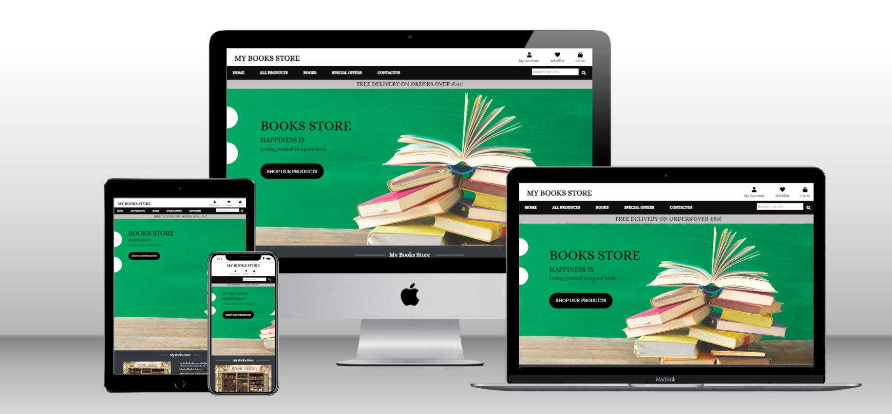

<h1> My Books Store - Online Book shop</h1>



<h3> Developer: Dhvani Intwala</h3>

## [TABLE OF CONTENTS](#table-of-contents)<!-- omit in toc -->

- [Overview](#overview)
- [User Experience (UX)](#user-experience-ux)
  - [Project goals](#project-goals)
  - [Project Objectives](#project-objectives)
- [User Stories](#user-stories)
  - [Strategy](#strategy)
  - [Scope](#scope)
  - [Skeleton](#skeleton)
- [Agile Methodology](#agile-methodology)
- [Features](#features)
  - [Home Page](#home-page)
  - [Navigation bar](#navigation-bar)
  - [All Products page](#all-products-page)
  - [Product details page](#product-details-page)
  - [Product Shopping Bag](#product-shopping-bag)
  - [Product Checkout](#product-checkout)
  - [Product Checkout Success](#product-checkout-success)
  - [Wishlist](#wishlist)
  - [Products Management](#products-management)
  - [Footer](#footer)
  - [User Profile](#user-profile)
  - [Login Page](#login-page)
  - [Signup Page](#signup-page)
  - [Signout Page](#signout-page)
  - [Reset Password page](#reset-password-page)
  - [Change Password page](#change-password-page)
  - [FAQ's page](#faqs-page)
  - [Privacy and policy Page](#privacy-and-policy-page)
  - [Terms and Conditions page](#terms-and-conditions-page)
  - [Admin panel / Superuser](#admin-panel--superuser)
  - [Error 404 page not found](#error-404-page-not-found)
  - [Messages and Interaction with Users](#messages-and-interaction-with-users)
    - [Signup](#signup)
    - [Login](#login)
    - [Signout](#signout)
    - [Profile Update](#profile-update)
    - [Add Product](#add-product)
    - [Edit Product 1](#edit-product-1)
    - [Edit Product 2](#edit-product-2)
    - [Edit Product 3](#edit-product-3)
    - [Delete Product 1](#delete-product-1)
    - [Delete Product 2](#delete-product-2)
    - [Delete Product 3](#delete-product-3)
    - [Add Product to Bag](#add-product-to-bag)
    - [Update Bag](#update-bag)
    - [Remove Product from Bag](#remove-product-from-bag)
    - [Purchase Success](#purchase-success)
- [Future Feature Considerations](#future-feature-considerations)
- [Business Model](#business-model)
- [Marketing](#marketing)
- [Responsive Layout and Design](#responsive-layout-and-design)
- [Testing](#testing)
- [AWS Setup Process](#aws-setup-process)
  - [AWS S3 Bucke](#aws-s3-bucke)
  - [IAM Set Up](#iam-set-up)
  - [Connecting AWS to the Project](#connecting-aws-to-the-project)
- [Stripe Payments](#stripe-payments)
  - [Payments](#payments)
  - [Webhooks](#webhooks)
- [Technologies Used](#technologies-used)
  - [Languages Used](#languages-used)
  - [Django Packages](#django-packages)
  - [Frameworks - Libraries - Programs Used](#frameworks---libraries---programs-used)
- [Creating the Django app](#creating-the-django-app)
- [Deployment of This Project](#deployment-of-this-project)
- [Deployment](#deployment)
  - [Deploy on Heroku](#deploy-on-heroku)
  - [Fork the repository](#fork-the-repository)
  - [Clone the repository](#clone-the-repository)
- [Credits](#credits)
  - [Code](#code)
  - [Media](#media)
  - [Acknowledgements](#acknowledgements)

## Overview

My Bookstore is an online store created for a fictional bookstore in 15 Route, Rhode Island, 87949,Germany. The main goal of the project was to implement a fully functional online store that makes it easy for customers to choose and buy book products.

Users have the opportunity to view each product and its details, create a wish list, add products to the cart, purchase using an online payment method and view order history.

The website is developed using Python (Django), HTML, CSS and JavaScript. Data was stored in a PostgreSQL database using ElephantSql for processing.

## User Experience (UX)

### Project goals

- To create an e-commerce application - My Books Store that is used for ordering Books by customers.

### Project Objectives

- To create a website with a simple and intuitive User Experience;
- To add content that is relevant and helps create a better image of the bookstore.
- To differentiate between client and staff member accounts.
- To implements fully functional features that make it easy for customers and upgrade client experience with bookstore service.
- To make the website available and functional on every device.

## User Stories

### Strategy

<h4> As a website user, I can</h4>

1. Navigate around the site and easily view the desired content.
2. View a list of products and choose accordingly.
3. Search products to find a specific product.
4. Click on a product to read and view the details.
5. Register for an account.

<h4> As a logged in website user, I can</h4>

1. Make wishlist products page in which I can edit or/and buy books at any time
2. Subscribe to a newsletter, so I can always be up to date with the latest promotions
3. Save my data under my personal profile.
4. Manage my profile by updating my details.
5. Logout of the website.
6. Using my personal profile, buy a product by using the website checkout system.

<h4> As a website Superuser, I can</h4>

1. Create and publish a new product.
2. Create a new user, products, and categories.
3. Delete user, products, categories and Ratings.
4. Change a users permissions on the website
5. Upload new banners to be displayed on the website.

### Scope

<h4> Simple and intuitive User Experience</h4>

- Ensure the navigation menu is visible and functional at every step
- Ensure every page has a suggestive name that fits its content
- Ensure the users will get visual feedback when navigating through pages
- Create a design that matches the requirements of an e-commerce website

<h4> Relevant content</h4>

- Add a representative cover image
- Add the website title and details about its purpose
- Add a section that includes information about the shop name, description, location and contact data
- Make a clear and beautiful designed presentation of the menu elements

<h4> Features for upgraded experience</h4>

- Created a list with all the products and group them by category
- Created a Bag feature that allows the user to add, update and remove products from the shopping bag
- Created a Wishlist feature that gives the user the possibility to add and remove items from the wishlist
- Created a Checkout feature for giving the user the possibility to complete an order on the website
- Created a Profile page for the user to add/update his delivery details and see his orders' history
- Created a Newsletter feature that allows the user to subscribe with his email
- Created a page for the staff members to manage all the orders for all the users
- Created a feature for the staff members to add/edit products on the website

<h4> Difference between client user and staff member Accounts</h4>

- Client User can add/remove products from wishlist but this feature is not available for staff members
- Only guest and client users can access the shopping bag and its features
- Only guest and client users can make an order on the website
- Only staff members can add/edit products
- Profile page are only available for guest &client users
- Orders page only available for staff member users

<h4> Responsiveness</h4>

Create a responsive design for desktop, tablet and mobile devices.

### Skeleton

<h4> Flowchart</h4>

The Flowchart for my program was created using Draw.io and it visually represents how the system works.

<h4> Wireframes </h4>

The wireframes for mobile and desktop were created with [Balsamiq](https://balsamiq.com/) tool and can be viewed [here](/static/wireframes/Wireframes.pdf)

<h4> Database </h4>

The project uses the relational database PostgreSQL to store the data. Two diagrams were created to show the relationships between the tables.

<details>

  <summary> Final Schema</summary>
  
</details>  
  
<h4> Design </h4>

The website is designed in a minimalist style to align with the
site's objectives. The simple design allows users to easily navigate the site and find what they are looking for.

<h4> Color scheme </h4>

The design is quite simple. The color scheme is used to ensure good contrast with the text and create a clear and visually appealing look for the website. The scheme establishes a strong contrast between background colors and text, ensuring that the site meets accessibility standards.

| Color         |Hex    |
| ---------- | ------ |
| Blue |  #444646 |
| Green |  #018031|
| Red |  #FF0000 |
| White |  #ffffff |
| Dark gray |  #0f0e0e |
| dark |  #2c313c|
| Light gray |  #dadadf |

## Agile Methodology

This project was developed using the agile methodology. All progress in implementing Epics and User Stories was captured using Trello. Necessary goals and priorities were well defined throughout the project. In addition, labels were used to define the priority of each user story on the Kanban board. As user stories were completed, they were moved from the To Do, Progress, and Done lists in the Trello board.

## Features

### Home Page

The website is designed to be welcoming and easy to use. It features a nav bar and nav links. It starts with the name of the website on the top left, search field in the right, my account and shopping bag to the top right, followed by a navigation menu links,free shipping threshold text and footer. All these appear on every page on the site. Also, found on home page is a hero image accompanied by a hero text, and a shop our products button beneath it.

### Navigation bar

- The navigation bar is located at the top of each page and contains all the links to  other pages.
- The links at the bottom of the navigation bar are drop-down menus. They are used to filter products.
- Once the user is logged in, their choice of Register or Login will change to Log Out.
- Once the user is logged in, there are other options in the navigation bar, such as a profile.
- The navigation bar also has a search field.
- The navbar is fully responsive. It collapses into a hamburger menu when the screen size decreases.

### All Products page

- On this page, users will see all the products available on the website such as product details. For example, if the user is interested in the watch they can press the button "Buy Now". They can also sort products by price, name, rating and category. Furthermore, when the site admin is logged in, it can edit or delete products.

### Product details page

- Here users can see the product image and product information such as price, category and rating. If the user is interested in the book they can choose the product quantity and add the product to their shopping bag. Also, the user can leave the page by pressing the button "Keep Shopping".Also the user can add that product to whislist if the user has login.The items with low stock have a banner to announce the user about their availability.
- Every products has a *details page* that includes full specifications.

### Product Shopping Bag

- This feature is called the Shopping bag. Here, users can add products and quantities. Check the total price, and delivery costs and go to the secure checkout to finish the order. Before secure checkout. the user can also change the quantity and remove unwanted products. The user can also leave this page by pressing the button "Keep Shopping".

### Product Checkout

- The *Checkout* page represents the final step in completing the order.
- A form for personal, delivery and payment details is displayed for the user to fill in with valid data. Additionally, a validation has been implemented to not allow other values to be submitted. The payment input has its own Stripe-implemented validation.
- An order summary is displayed with details about the products and cost.
- After the order is completed, the user is sent to a *Checkout Success* page with full specifications and details.

### Product Checkout Success

- Here the user can see the thank you page with information like order number, order date, billing info, and delivery address. At the bottom the user click on check out on new arrivals then the user can see new arrivals books.

### Wishlist

- On the *Product Details* page there is an interactive feature that is only available for logged-in users that are not staff members. A user can add a product to the wishlist by clicking on add to wishlist button. This feature is also accessible on the *Bag* page.
- In the *Wishlist* page there are listed all the favourite items of the user with a design similar to the one created for the *Products* pages. A filtering and sorting section is also available and every element is linked to a *Product Details* page.
- An additional feature would be that every item includes a representation of the number of times it has been added to the wishlist by all the users.

### Products Management

- When the website admin is logged in on this page, they can add a new product to the website without going to the admin panel.

### Footer

- On the website footer, users can see basic information about the My books store. The information includes contact, social media, copyright, and a form where they can subscribe to the newsletter.
  
### User Profile

The *User Profile* page gives the user access to individual and private features.

- The page includes a form for adding or updating the delivery details. These details are saved in the database and whenever the user is logged in and wants to make an order, the values will be automatically set in the checkout form.

- Another important feature is the **Orders history** which is represented by a table with all the orders created by the user. Any order element has a details page that can be accessed by clicking on the order number value.

### Login Page

- On the Login Page, users can log in to the website by inputting their username and password. The user is now registered and will have access to the Registered User website services.

### Signup Page

- On the Signup page , new user can create there profile by filling the signup form.

### Signout Page

- On the Signout Page, users can confirm that they wish to exit the website.

### Reset Password page

- Users can use this page to reset their login password. The user adds their email address in the input field and clicks on the button "Reset Password".

### Change Password page

- Users will get a link to reset their password and after clicking on the link it will redirect the user to this page where they can set a new password.

### FAQ's page

- If the users has any question related to Shopping , they might find here. In FAQ's there are answers for the most frequently asked question.

### Privacy and policy Page

- Here the Users can go though our privacy policies.

### Terms and Conditions page

- User can go through Terms and condition regarding shopping in this page.

### Admin panel / Superuser

- The admin account was created as a superuser account from the terminal and also has access to the admin panel.
- Here the Admin / superuser can view, create, edit and delete the following apps:
  
1. Banner
2. Checkout
3. Products
4. Profiles
5. Ratings

- There is a page created especially for staff members to keep better track of all the orders placed on the website.

### Error 404 page not found

- The user will see this feature when the page that the user is looking for, does not exist or for any typing URL error.

### Messages and Interaction with Users

- Some interactive messages were added to the project to make the navigation on the website easier and to improve the user's experience.

#### Signup

- When users sign up to the website they will see a message at the top right of the page saying ""

#### Login

- When users login to the website they will see a message at the top right of the page saying ""

#### Signout

- When users sign up to the website they will see a message at the top right of the page saying ""
  
#### Profile Update

- When users sign up to the website they will see a message at the top right of the page saying ""
  
#### Add Product

- When the website admin is logged in, they can add new products through the website front-end. When submitted successfully the following message "" pops up at the top right of the page.

#### Edit Product 1

- When the website admin is logged in, they can edit products already added through the website's front-end by clicking on the "Edit" button.

#### Edit Product 2

- Once the button is clicked the website admin will see the following alert "" at the top right of the screen.

#### Edit Product 3

- After the "Update Product" button is pressed and the product is edited successfully, the website admin will see the message "" at the top right of the page.

#### Delete Product 1

- When the website admin is logged in, they can delete products already added through the website’s front-end by clicking the "Delete" button.

#### Delete Product 2

- After pressing the "Delete" button the Bootstrap box model will pop up with a message ""at the in the ''page.

#### Delete Product 3

- When the user presses the "Delete" button again within the Bootstrap box model they will see the message "Product deleted" at the top right of the page.

#### Add Product to Bag

- When users choose a product and add it to the bag they will see a success message at the top right of the screen.

#### Update Bag

- When users update the bag they will see a success message at the top right of the screen.

#### Remove Product from Bag

- When users remove the products from the bag they will see a success message at the top right of the screen.

#### Purchase Success

- When users fill out the check-out form and complete the purchase they will see a success message with the order details at the top right of the screen.

## Future Feature Considerations

---

- Implementing a chat feature for communication between customers and staff members.
- Implementing vocher and discount features.
- Customers can add a comment and review the product.

## Business Model

- The business model chosen for this project is **Businesgit stas to Customer**, as the main purpose of the website is to deliver final products to customers. This model was implemented using an interactive, attractive and intuitive interface that gives the clients an upgraded experience for shopping.

## Marketing

- The marketing strategy includes a Facebook business page that is intended to create a good image of the store by posting news and promotions available. By highly promoting the products and always adding new content, the page will increase its popularity and attract more and more customers to buy from the online store.

## Responsive Layout and Design

- The project design has been adapted to all types of devices using Bootstrap predefined breakpoints. For intermediate devices where the design didn't fit accordingly, custom breakpoints were used.

**Breakpoints:**

- max-width:380px(extra small devices)
- max-width:768px(small devices)
- max-width:992px(medium devices)
- min-width:1024px and max-width: 1024px(IpadPro)
- max-width:1200px(large devices)

**Tested devices:**

- Moto G4
- iPhone SE
- iPhone XR
- iPhone 11
- iPhone 13
- iPhone 5/SE
- iPhone 6/7/8
- Ipad
- Ipad Air
- Ipad Mini
- Ipad Pro
- Pixel 5
- Surface Duo
- Surface Pro 7
- Nest Hub
- Nest Hub Max
- Samsung Galaxy S20 Ultra
- Samsung Galaxy S8
- Galaxy Note 2
- Galaxy Tab S4
- Asus Vivobook

## Testing

The testing documentation can be found at [TESTING.MD](TESTING.MD)

## AWS Setup Process

### AWS S3 Bucke

The deployed site uses AWS S3 Buckets to store the webpages static and media files. More information on how you can set up an AWS S3 Bucket can be found below:

- Create an AWS account [here](https://portal.aws.amazon.com/).
- Login to your account and within the search bar type in "S3"
- Within the S3 page click on the button that says "Create Bucket"
- Name the bucket and select the region which is closest to you
- Underneath "Object Ownership" select "ACLs enabled".
- Uncheck "Block Public Access" and acknowledge that the bucket will be made public, then click "Create Bucket".
- Inside the created bucket click on the "Properties" tab. Below "Static Website Hosting" click "Edit" and change the Static website hosting option to "Enabled". Copy the default values for the index and error documents and click "Save Changes".
- Click on the "Permissions" tab, below "Cross-origin Resource Sharing (CORS)", click "Edit" and then paste in the following code:

```
    [
        {
            "AllowedHeaders": [
            "Authorization"
            ],
            "AllowedMethods": [
            "GET"
            ],
            "AllowedOrigins": [
            "*"
            ],
            "ExposeHeaders": []
        }
    ]
```

- Within the "Bucket Policy" section. Click "Edit" and then "Policy Generator". Click the "Select Type of Policy" dropdown and select "S3 Bucket Policy" and within "Principle" allow all principals by typing "*".
- Within the "Actions" dropdown menu select "Get Object" and in the previous tab copy the "Bucket ARN number". Paste this within the policy generator within the field labelled "Amazon Resource Name (ARN)".
- Click "Add statement > Generate Policy" and copy the policy that's been generated and paste this into the "Bucket Policy Editor".
- Before saving, add /* at the end of your "Resource Key", this will allow access to all resources within the bucket.
- Once saved, scroll down to the "Access Control List (ACL)" and click "Edit".
- Next to "Everyone (public access)", check the "list" checkbox and save your changes.

### IAM Set Up

- Search for IAM within the AWS navigation bar and select it.
- Click "User Groups" that can be seen in the side bar and then click "Create group" and name the group 'manage-your-project-name'.
- Click "Policies" and then "Create policy".
- Navigate to the JSON tab and click "Import Managed Policy", within here search "S3" and select "AmazonS3FullAccess" followed by "Import".
- Navigate back to the recently created S3 bucket and copy your "ARN Number". Go back to "This Policy" and update the "Resource Key" to include your ARN Number, and another line with your ARN followed by a "/*".
- Below is an example of what this should look like:
  
```
{
    "Version": "2012-10-17",
    "Statement": [
        {
            "Effect": "Allow",
            "Action": [
                "s3:*",
                "s3-object-lambda:*"
            ],
            "Resource": [
                "YOUR-ARN-NO-HERE",
                "YOUR-ARN-NO-HERE/*"
            ]
        }
    ]
}

```

- Download the "CSV file", which contains the user's access key and seret access key.

### Connecting AWS to the Project

- Within your terminal install the following packages by typing

```
  pip3 install boto3
  pip3 install django-storages 
```  

```
  pip3 install boto3
  pip3 install django-storages 
```  


- Freeze the requirements by typing:

```
pip3 freeze > requirements.txt
```

- Add "storages" to your installed apps within your settings.py file.
- At the bottom of the settings.py file add the following code:

```
if 'USE_AWS' in os.environ:
    AWS_STORAGE_BUCKET_NAME = 'insert-bucket-name-here'
    AWS_S3_REGION_NAME = 'insert-your-region-here'
    AWS_ACCESS_KEY_ID = os.environ.get('AWS_ACCESS_KEY_ID')
    AWS_SECRET_ACCESS_KEY = os.environ.get('AWS_SECRET_ACCESS_KEY')
```

- Add the following keys within Heroku: "AWS_ACCESS_KEY_ID" and "AWS_SECRET_ACCESS_KEY". These can be found in your CSV file.
- Add the key "USE_AWS", and set the value to True within Heroku.
- Remove the "DISABLE_COLLECTSTAIC" variable from Heroku.
- Within your settings.py file inside the code just written add:

```
  AWS_S3_CUSTOM_DOMAIN = f"{AWS_STORAGE_BUCKET_NAME}.s3.amazonaws.com"
```

- Inside the settings.py file inside the bucket config if statement add the following lines of code:

```
STATICFILES_STORAGE = 'custom_storages.StaticStorage'
STATICFILES_LOCATION = 'static'
DEFAULT_FILE_STORAGE = 'custom_storages.MediaStorage'
MEDIAFILES_LOCATION = 'media'

STATIC_URL = f'https://{AWS_S3_CUSTOM_DOMAIN}/{STATICFILES_LOCATION}/'
MEDIA_URL = f'https://{AWS_S3_CUSTOM_DOMAIN}/{MEDIAFILES_LOCATION}/'

AWS_S3_OBJECT_PARAMETERS = {
    'Expires': 'Thu, 31 Dec 2099 20:00:00 GMT',
    'CacheControl': 'max-age=94608000',
}
```

- In the root directory of your project create a file called "custom_storages.py". Import the following at the top of this file and add the classes below:

```
  from django.conf import settings
  from storages.backends.s3boto3 import S3Boto3Storage

  class StaticStorage(S3Boto3Storage):
    location = settings.STATICFILES_LOCATION

  class MediaStorage(S3Boto3Storage):
    location = settings.MEDIAFILES_LOCATION
```

- Navigate back to you AWS S3 Bucket and click on "Create Folder" name this folder "media", within the media file click "Upload > Add Files" and select the images for your site.
- Under "Permissions" select the option "Grant public-read access" and click "Upload".

## Stripe Payments

- The Stripe payments system is set up as the online payment processing and credit card processing platform for the purchases.
You will need a stripe account which you can sign up for [here](https://stripe.com/en-ie)

### Payments

- To set up stripe payments you can follow their guid [here](https://stripe.com/docs/payments/accept-a-payment#web-collect-card-details)

### Webhooks

- To set up a webhook, sign into your stripe account and click 'Developers' located in the top right of the navbar.
- Then in the side-nav under the Developers title, click on "Webhooks", then "Add endpoint".
- On the next page you will need to input the link to your heroku app followed by /checkout/wh/. It should look something like this:

```
https://your-app-name.herokuapp.com/checkout/wh/
```

- Then click "+ Select events" and check the "Select all events" checkbox at the top before clicking "Add events" at the bottom. Once this is done finish the form by clicking "Add endpoint".
- Your webhook is now created and you should see that it has generated a secret key. You will need this to add to your heroku config vars.
- Head over to your app in heroku and navigate to the config vars section under settings. You will need the secret key you just generated for your webhook, in addition to your Publishable key and secret key that you can find in the API keys section back in stripe.
- Add these values under these keys:

```
STRIPE_PUBLIC_KEY = 'insert your stripe publishable key'
STRIPE_SECRET_KEY = 'insert your secret key'
STRIPE_WH_SECRET = 'insert your webhooks secret key'
```

- Finally, back in your settings.py file in django, insert the following near the bottom of the file:

```
STRIPE_PUBLIC_KEY = os.getenv('STRIPE_PUBLIC_KEY', '')
STRIPE_SECRET_KEY = os.getenv('STRIPE_SECRET_KEY', '')
STRIPE_WH_SECRET = os.getenv('STRIPE_WH_SECRET', '')
```

Below is a screenshot of the My Books store - Stripe dashboard.


## Technologies Used

### Languages Used

- [HTML 5](https://en.wikipedia.org/wiki/HTML/)
- [CSS 3](https://en.wikipedia.org/wiki/CSS)
- [JavaScript](https://www.javascript.com/)
- [Django](https://www.python.org/)
- [Python](https://www.djangoproject.com/)

### Django Packages

- [Gunicorn](https://gunicorn.org/) as the server for Heroku
- [Dj_database_url](https://pypi.org/project/dj-database-url/) to parse the database URL from the environment variables in Heroku
- [Psycopg2](https://pypi.org/project/psycopg2/) as an adaptor for Python and PostgreSQL databases
- [Allauth](https://django-allauth.readthedocs.io/en/latest/installation.html) for authentication, registration and account management
- [Stripe](https://pypi.org/project/stripe/) for processing all online and credit card purchases on the website
- [Crispy Forms](https://django-crispy-forms.readthedocs.io/en/latest/) to style the forms
- [Pillow](https://pypi.org/project/Pillow/) to process and save all the images downloaded through the database

### Frameworks - Libraries - Programs Used

- [Bootstrap](https://getbootstrap.com/)
was used to style the website, add responsiveness and interactivity
- [Jquery](https://jquery.com/) - all the scripts were written using jquery library
- [Git](https://git-scm.com/) was used for version control by utilizing the Gitpod terminal to commit to Git and push to GitHub
- [GitHub](https://github.com/) was used to store the project's code after being pushed from Git
- [Heroku](https://id.heroku.com) was used to deploy the live project
- [PostgreSQL](https://www.postgresql.org/) Database used through Heroku
- [Drawio](https://www.drawio.com/) was used to create the database diagram, flowchart and bussiness model
- [W3C - HTML](https://validator.w3.org/) was used to validate all the HTML code
- [W3C - CSS](https://jigsaw.w3.org/css-validator/) was used to validate the CSS code
- [Fontawesome](https://fontawesome.com/) was used to add icons to the website
- [Google Chrome Dev Tools](https://developer.chrome.com/docs/devtools/) was used to check App responsiveness and debugging
- [Google Fonts](https://fonts.google.com/) was used to add the 2 fonts that were used throughout the project
- [Balsamiq](https://balsamiq.com/) was used to build the wireframes for the project
- [AWS](https://aws.amazon.com/) was used to host the static files and media

## Creating the Django app

1. Go to the Code Institute Gitpod Full Template [Template](https://github.com/Code-Institute-Org/gitpod-full-template)
2. Click on Use this Template
3. Once the template is available in your repository click on Gitpod
4. When the image for the template and the Gitpod are ready open a new terminal to start a new Django App
5. Install Django and gunicorn: pip3 install django gunicorn
6. Install supporting database libraries dj_database_url and psycopg2 library: pip3 install dj_database_url psycopg2
7. Create file for requirements: in the terminal window type pip freeze --local > requirements.txt
8. Create project: in the terminal window type django-admin startproject your_project_name
9. Create app: in the terminal window type python3 manage.py startapp your_app_name
10. Add app to the list of installed apps in settings.py file: you_app_name
11. Migrate changes: in the terminal window type python3 manage.py migrate
12. Run the server to test if the app is installed, in the terminal "The install worked successfully! Congratulations!"

## Deployment of This Project

This site was deployed by completing the following steps:

- Log in to [Heroku](https://id.heroku.com) or create an account.
- On the main page click the button labelled New in the top right corner and from the drop-down menu select Create New App.
- You must enter a unique app name
- Next select your region
- Click on the Create App button
- Click in resources and select Heroku Postgres database
- Click Reveal Config Vars and add:

  - A new record with SECRET_KEY
  - A new record with the AWS_ACCESS_KEY_ID
  - A new record with the AWS_SECRET_ACCESS_KEY
  - A new record with the EMAIL_HOST_PASS
  - A new record with the EMAIL_HOST_USER
  - A new record with the STRIPE_PUBLIC_KEY
  - A new record with the STRIPE_SECRET_KEY
  - A new record with the STRIPE_WH_SECRET
  - A new record with the DISABLE_COLLECTSTATIC = 1

- The next page is the projects Deploy Tab. Click on the Settings Tab and scroll down to Config Vars
- Next, scroll down to the Buildpack section click Add Buildpack select python and click Save Changes.
- Scroll to the top of the page and choose the Deploy tab.
- Select Github as the deployment method.
- Confirm you want to connect to GitHub.
- Search for the repository name and click the connect button
- Scroll to the bottom of the deploy page and select the preferred deployment type
- Click Enable Automatic Deploys for automatic deployment when you push updates to Github

## Deployment

### Deploy on Heroku

- Create Pipfile
- In the terminal enter the command `pip3 freeze > requirements.txt`, and a file with all the requirements will be created.

- Setting up Heroku

  - Go to [Heroku website](https://www.heroku.com)
  - Login to Heroku and choose *Create App*
  - Click *New* and *Create a new app*
  - Choose a name and select your location
  - Go to the *Resources* tab
  - From the Resources list select *Heroku Postgres*
  - Navigate to the *Deploy* tab
  - Click on *Connect to Github* and search for your repository
  - Navigate to the *Settings* tab
  - Reveal Config Vars and add your Cloudinary, Database URL (from Heroku-Postgres) and Secret key.

- Deployment on Heroku

  - Go to the Deploy tab.
  - Choose the main branch for deploying and enable automatic deployment
  - Select manual deploy for building the App

### Fork the repository

For creating a copy of the repository on your account and change it without affecting the original project, use fork directly from GitHub:

- On [My Repository Page](https://github.com/Dhvani-intwala/My-Books-Store), press fork in the top right of the page

- A forked version of my project will appear in your repository

### Clone the repository

For creating a clone of the repository on your local machine, use clone:

- On [My Repository Page](https://github.com/Dhvani-intwala/My-Books-Store), click the code green button, right above the code window
- Chose from HTTPS, SSH and GitClub CLI format and copy (preferably HTTPS)
- In your IDE, open Git Bash
- Enter the command git clone followed by the copied URL
- Your clone was created

## Credits

- The texts and images that are used for testimonials were taken from google.

### Code

- [Django Documenation](https://www.djangoproject.com/) was used to provide examples of code solutions and Django functionality.
- [Bootstrap Documenation](https://getbootstrap.com/) was used to provide examples of Bootstrap functionality and building blocks.
- [Code Institute walkthrough](https://codeinstitute.net/) as inspiration and code examples, the code institute walkthroughs "Hello Django" and "I Think Therefore I Blog" was used.
- [newsletter reference](https://www.youtube.com/watch?v=hWtlskOaFNI)
- The wiggle animation was taken and adapted from [codepen](https://codepen.io/beben-koben/pen/PZYjwX)

### Media

- Most of the pictures for the project was taken from [Pexels](https://www.pexels.com) and [Pixabay](https://pixabay.com)
- All products images used on the site were taken from [Google](https://www.google.com)

### Acknowledgements

- The tutor support team at Code Institute for their support.
- My Code Institute Mentor for feedback and suggestions.
- The Code Institute Slack community.

[Back to top](#table-of-contents)
