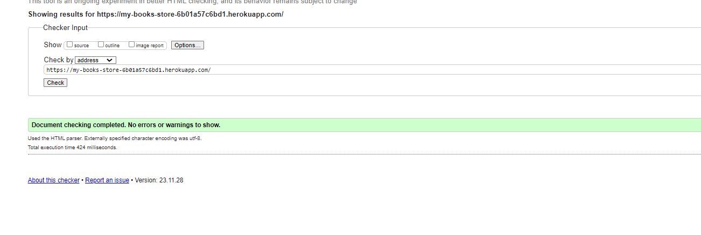

# Testing

Back to the [README](README.md)

- Testing has taken place continuously throughout the development of the project. Each view was tested regularly.When the outcome was not as expected, debugging took place at that point.  

#### Python Validation - Pycodestyle

- Python testing was done using the Pycodestyle to ensure there were no syntax errors in the project. All python files
were entered into the checker and no errors were found in any of the custom codes.

.

#### Checked Python Files

#### App - Bag

- apps.py
- context.py
- urls.py
- views.py

#### Checkout - Bag

- admin.py
- apps.py
- forms.py
- models.py
- signals.py
- urls.py
- views.py
- webhook_handler.py
- webhooks.py

#### Home - Bag

- admin.py
- apps.py
- models.py
- urls.py
- views.py

#### Products - Bag

- admin.py
- apps.py
- context_processors.py
- forms.py
- models.py
- urls.py
- views.py
- widgets.py
  
#### Profiles - Bag

- admin.py
- apps.py
- forms.py
- models.py
- urls.py
- views.py

### Javascript

The Javascript code was validated using using [JsHint](https://jshint.com/)
At the time of deployment the validation for *script.js* has the following outcome:

script.js

checkout.js

- The script for defining the Stripe methods contains *Stripe* variable that generate the error in the linter. As this is a script taken and adapted from the [Stripe Documentation](https://stripe.com/docs/development), I choose to ignore this issue as there is no fix found for it.
  

profiles.js

- The warnings listed are caused of the EventListeners added to elements in a loop. 
I tried to solve the issue but no successful method has been found, so I chose to ignore the warning as it is not affecting the way my code works in any way.

### Lighthouse

Lighthouse was used to test Performance, Best Practices, Accessibility and SEO on Desktop.

##### Desktop Results:

###### Mobile Results:

### HTML Validation

The following pages have been tested:

- Home
- Products
- Product details
- Bag
- Checkout
- User Profile
- Newsletter
- FAQs
- Contactus
- Wishlist
- Login/Register
- 403/404/500 custom pages

### CSS Validation

- Custom CSS was validated using W3C Jigsaw validation service. Seventeen warnings were displayed, however,
  these are related to Google Fonts and vendor extension prefixes which will not affect the CSS performance.

## Browser Testing

- The Website was tested on Firefox, Google Chrome, and Safari browsers with no issues noted.

## Console result

## Manual Testing

### Home

- I confirmed logo acts as a redirect link to the home page.
- I confirmed all the links on the nav bar are clickable and redirect the user to their related page i.e. login, logout, product categories, contact us, faqs,  wishlist, product managment, newsletter-message.
- I confirmed search bar works effectively even on keywords such as 'oo'.
- I confirmed user can select products based on category and it will show only those products based on that category.
- I confirmed the page is responsive as per different screen sizes
-I confirmed that link to privacy & police , Terms & Conditions and social media links Opens in a new tab. 

### All Products

- I confirmed all the products here are clickable and redirected the user to the product details page
- I confirmed all the product categories and items on sale are visible here.
- I confirmed products will also display relevant information such as image, name, and price.

### Product with category

- I confirmed only specific categories of products will be displayed here such as Books.
- The items on sale are also visible but belong only to that specific category.
- I confirmed products will also display relevant information such as image, name, and price.

## Product Detail

- I confirmed user can add/remove/update items from the cart while on the product details page.
- I confirmed user can add products to the wishlist from here.
- I confirmed user can checkout, meaning redirect to the cart page from this page.
- I confirmed user can view details of the product along with its description.

### Cart

- I confirmed user can remove items from the cart.
- I confirmed user can view relevant details of the product from the cart.
- I confirmed user can view the total price from inside the cart.
- I confirmed user can go to shipping details from the cart.

### Shipping Details

- I confirmed the fields will be empty for every new user.
- I confirmed All the fields here are editable except the Method dropdown which is set to COD.
- I confirmed user can update the shipment data, each time when user places an order.
- I confirmed that the fields can't be set empty.
- I confirmed the button here completes the order process.

### Order Complete

- I confirmed user can see that the order was placed successfully.
- I confirmed the user is shown the time duration when they will receive the order.
- I confirmed if the user goes back to shipping and clicks finish order, the user will be redirected to my orders as the order is already placed.
- I confirmed user is given clickable options to redirect from this page.

### My Orders

- I confirmed user can see all the orders they have placed from my orders page.
- I confirm user can update their “user details” while being on my orders page.

## Wishlist

- I confirmed that only items the user had added to the Wishlist are displayed here.
- I confirmed products will also display relevant information such as image, name, and price.

### contact us

- I confirmed

### Newsletter

- I confirmed that user can subscribe to newsletter.
- I confirmed that admin can sent messages to all subscribers together.

### faqs

- I confirmed that only faqs the admin had added and displayed in faqs page.

## Bugs

- In mobile and ipad device navbar toggler icon was not appering, then I have added class navbar dark and bg dark and the bug was fixed.

- There was a Problem with Header padding, because the header is implemented with position: fixed, I had to set a padding-top for the main container so it appears as if it is positioned below the header's content. In order to find the padding-top value that matches the header's height for every device, I used javascript to dynamically adjust it. This is why when testing the website for responsiveness using dev tools, the padding only changes its value on page reload. This bug is not visible when testing on real devices.

- Admin user was not able to edit the product details. Because in ProductForm class, the issue with the "category" field arises because it's defined as a forms.ChoiceField, but it should be a ModelChoiceField instead. The ModelChoiceField is specifically designed to handle foreign key relationships between models, like the "category" field in your Product model.
